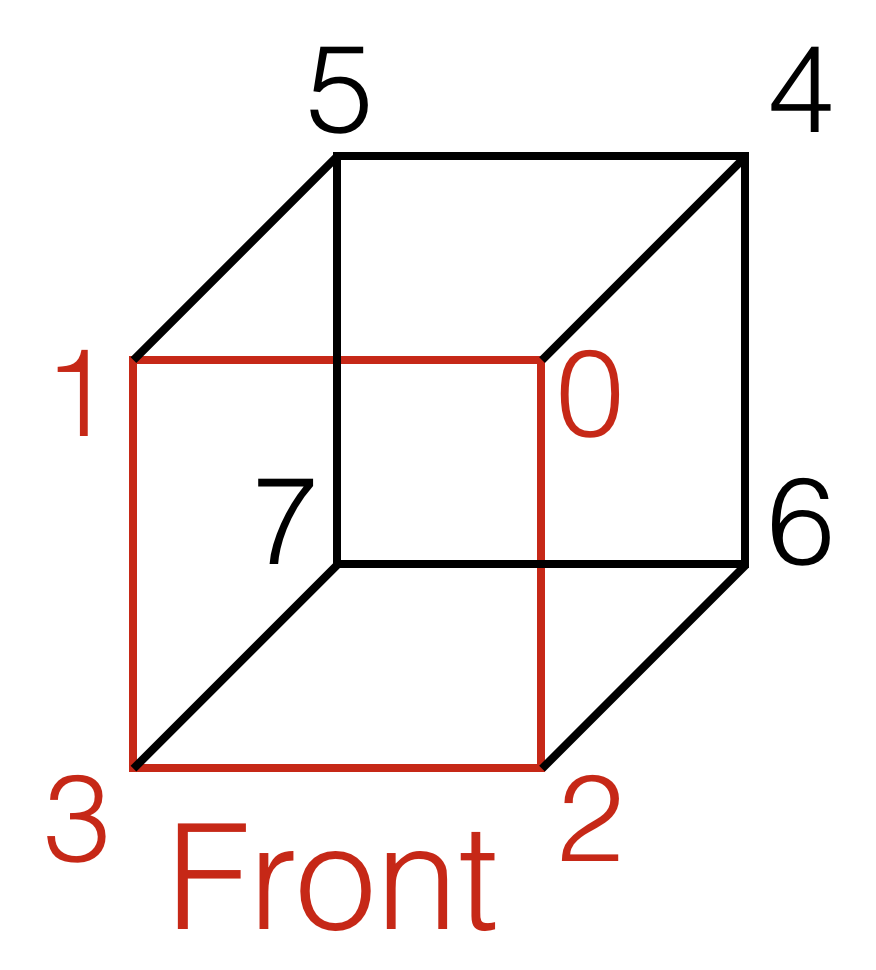

# 3D-Graphics

For this project, you will be working to draw and rotate three-dimensional cubes.

You may work individually or with a partner of your choosing.

## Setup

Use this Guided Project template to create a new repository (see [GitHub-with-CLion](https://github.com/uvmcs2300s2025/GitHub-with-CLion) repo for directions).
**Your repository must be named with the convention: 3D-Graphics-netid**, where netid is your UVM NetID username.
* If you are collaborating, the format is 3D-Graphics-netid1-netid2. Have one partner create the repository and give the other partner access on GitHub: on the repository page, go to the Settings tab, choose Manage Access, and add the person with their GitHub username.

Remember to commit and push frequently.

# Drawing the cube

Below is a labeling of the indices of the cube at its starting position. It will be useful when drawing the faces.



One face of one cube have been drawn for you. It is the face that originally faces forward (with corners colored blue, yellow, green, and red). It should appear on the left side of your screen when you run the starter code. 

**Draw the other five faces of the cube.** This should be done in the Cube's ```initVectors``` method. This will require you to complete both the vertices and indices (see TODO comments). The order of the indices matters when drawing, so it's recommended that you draw one face of the cube at a time to ensure correct implementation.

Note that you should not be able to see some faces until you implement rotation by different axes.

# Rotating the cube

Luckily for you, the Cube already has partially functioning x-rotation, which you can see by pressing the up arrow.

**Implement rotation in the other x-direction as well as both y-directions and both z-directions.** The arrow keys will handle x- and y-rotations and the period and comma keys will handle z-rotations. This should be done by completing the first TODO in ```engine.cpp```'s `processInput` method.

# Add a Second Cube

Once you have the cube fully drawn and rotating, let's add a second cube. The second cube should appear on the right side of the screen and should mirror the one you've already drawn.

**Complete the rest of the TODOs in engine.cpp** to draw the second cube and have it mirror the first in its placement, colors, and rotations (imagine a mirror placed vertically in the middle of the graphics window).

## Grading

If you are collaborating, both partners have to submit the project.

### Grading Rubric
- [ ] (10 pts) Draw other five faces of the cube.
- [ ] (5 pts) Rotate the cube in all three dimensions.
- [ ] (5 pts) Add the second cube that mirrors the first.
